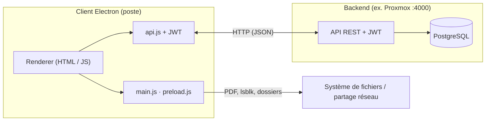

<p align="center">
  <a href="https://github.com/K0uzia/workspace/tree/main/docs"></a>
  <a href="https://opensource.org/licenses/MIT"></a>
  <a href="https://github.com/K0uzia"></a>
</p>
<p align="center">
  <a href="https://github.com/K0uzia/workspace/blob/main/package.json"></a>
  <a href="https://github.com/K0uzia/workspace/blob/main/package.json"></a>
  <a href="https://github.com/K0uzia/workspace/blob/main/apps/client/package.json"></a>
</p>

---

## 1. Qu’est-ce que Workspace

**Workspace** est une application de bureau (**Electron**) pour un atelier / une structure qui reçoit, reconditionne et archive du matériel.

Elle ne sert plus de portail d’applications, de raccourcis ou de dossiers réseau. L’interface actuelle a **deux espaces** :

- **Agenda** : calendrier partagé (semaine, mois, année)
- **Réception** : saisie, inventaire, PDF et archives (lots, disques, commandes, dons, prêts)

Les données métier passent par un **backend Fastify + PostgreSQL** (dossier `proxmox/app/`). Le client parle HTTP (JSON) avec **JWT**, sans écran de connexion dans l’UI.

**Démo navigateur** (sans Electron, données fictives) : [https://k0uzia.github.io/workspace/](https://k0uzia.github.io/workspace/)

---

## 2. Architecture

### 2.1 Vue d’ensemble

| Composant | Rôle |
| --------- | ---- |
| **Client Electron** | UI HTML/JS (pas React), navigation, appels HTTP via `public/assets/js/config/api.js`, PDF via IPC, mises à jour (`electron-updater`). Processus principal : `apps/client/main.js` ; pont : `preload.js`. |
| **Serveur backend** | `proxmox/app/` : **Fastify** + **TypeScript** + **PostgreSQL** + JWT. Port par défaut **4000**. Voir [proxmox/app/README.md](proxmox/app/README.md). |

Les URL sont dans `connection.json` (`apps/client/config/` et miroir `apps/client/public/config/`) : environnements `local`, `proxmox`, `production`. Le mode actuel du dépôt est **`proxmox`**.

Le monorepo npm ne contient que **`apps/client`**. Il n’y a pas de `apps/server`.

### 2.2 Schéma logique



| Lien | Usage actuel |
| ---- | ------------ |
| **HTTP** | Agenda, lots, disques, commandes, dons, prêts, catalogue marques/modèles, PDF, e-mail |
| **IPC Electron** | Génération PDF, ouverture de fichiers, détection disques (`lsblk` sous Linux) |
| **WebSocket** | Présent dans la config ; **pas d’UI chat** dans le client actuel |

### 2.3 Arborescence

```
workspace/
├── apps/client/                    # Seul workspace npm : Electron
│   ├── main.js, preload.js
│   ├── config/connection.json      # URL serveur (miroir : public/config/)
│   └── public/                     # Interface
│       ├── index.html, app.js
│       ├── pages/                  # agenda, reception
│       ├── reception-pages/        # lots, disques, commande, dons, prets, inventaire, historique
│       ├── components/             # header, footer, paramètres
│       └── assets/js/modules/
├── proxmox/app/                    # Backend Fastify
├── demo/                           # Démo statique (localStorage)
├── docs/                           # API, JWT, Electron…
├── scripts/
├── .github/workflows/              # Build client + publication démo Pages
└── package.json
```

**Stack client :** Node.js ≥ 18, Electron 39.x, JavaScript renderer, `electron-builder`.

---

## 3. Fonctionnement de l’application

Page d’entrée : **Agenda**. Le header contient uniquement Agenda, Reception, le **thème** clair/sombre, et **Paramètres** (mises à jour).

### 3.1 Navigation

| Élément | Action |
| ------- | ------ |
| Logo / Workspace | Agenda |
| **Agenda** | Calendrier |
| **Reception** | Module matériel (sous-page **Lots** par défaut) |
| Thème | Bascule clair / sombre (`localStorage`) |
| Paramètres | Vérifier / télécharger / redémarrer pour une mise à jour GitHub |

Le pied de page (Agenda) affiche version, IP locale, RAM, état serveur et réseau.

**Hors navigation (retirés) :** Accueil, Dossier, Applications, Raccourcis, Chat, écran de connexion, Options, Traçabilité comme page séparée.

### 3.2 Agenda

- Vues **semaine**, **mois**, **année**
- Création, modification, suppression d’événements (titre, dates, journée entière, description, couleur)
- Synchronisation `GET/POST /api/agenda/events`
- Jours fériés métropole en lecture seule (`/api/agenda/holidays`)

### 3.3 Réception

Sidebar interne en deux groupes.

**Flux (saisie)**

| Page | Rôle |
| ---- | ---- |
| **Lots** | Arrivée de machines : scan douchette ou saisie S/N, type, marque, modèle. Enregistrement → lot **actif** en Inventaire. |
| **Disques** | Session d’effacement / destruction. Saisie ou **détection Linux** (`lsblk`). PDF à l’enregistrement. |
| **Commande** | Bon de commande : produits, quantités, prix, port, lien. PDF + persistance. |
| **Dons** | Certificat de don (matériel + bénéficiaire). PDF. |
| **Prêts matériel** | Fiche de prêt / location (emprunteur, dates, lignes). PDF. |

**Suivi**

| Page | Rôle |
| ---- | ---- |
| **Inventaire** | Lots **en cours** uniquement. Édition PC (état, technicien, OS). Quand tous les PC sont complets, le lot passe **terminé** et un PDF final est généré. |
| **Historique** | Archives **lots, disques, commandes, dons, prêts** (ex-traçabilité fusionnée). Filtres, détail, édition selon le type, PDF (voir / dossier / régénérer), e-mail pour lots et sessions disques, marquage « récupéré » pour lots et disques. |

Les lots PC sont le seul flux avec une étape Inventaire. Les autres types vont directement en Historique après enregistrement.

```
Lots  ──► Inventaire ──► Historique (+ PDF final)
Disques / Commande / Dons / Prêts ──► Historique (+ PDF à l’enregistrement)
```

### 3.4 Auth, thème, mises à jour

- **JWT silencieux** : token en `localStorage`, vérifié via `/api/auth/verify`. Pas de modale de compte dans l’UI actuelle (les API réception restent authentifiées).
- **Thème** : sombre par défaut, toggle dans le header.
- **Mises à jour** : `electron-updater` interroge les **GitHub Releases** du dépôt `K0uzia/workspace`. Un point orange sur Paramètres signale une version disponible.

---

## 4. Cybersécurité (client)

- **CSP** dans `public/index.html`
- **JWT** ajouté par le module API ; session expirée (HTTP 401) gérée côté renderer
- **Electron** : `nodeIntegration: false`, `contextIsolation: true`, API limitée via `preload.js`
- **CI** : publication des binaires avec secrets (`GH_TOKEN` / `GITHUB_TOKEN`), jamais de token en clair dans le dépôt

---

## 5. Lancer et déployer

### 5.1 Développement

```bash
npm ci          # racine, Node ≥ 18
npm start       # client Electron
```

Backend (à part) :

```bash
cd proxmox/app && npm install && npm run dev
```

Pointer le client vers le serveur via `connection.json` (`local` ou `proxmox`).

Démo statique :

```bash
python3 -m http.server 8080 --directory demo
```

### 5.2 Client (postes)

| Étape | Détail |
| ----- | ------ |
| **Artefacts** | AppImage / deb (Linux), NSIS ou portable (Windows), DMG (macOS) via **electron-builder** dans `apps/client/dist/` |
| **Linux AppImage** | `chmod +x workspace.AppImage && ./workspace.AppImage` |
| **Linux .deb** | `sudo apt install ./workspace.deb` |
| **Build local** | `npm run build:linux` ou `npm run build:prod:linux:local` (sans Release GitHub) |
| **Mises à jour** | **electron-updater** + GitHub Releases |
| **CI** | [.github/workflows/build-client.yml](.github/workflows/build-client.yml) sur push `main` (`apps/client/`, `package.json`) |

Sous Linux, la détection de disques et l’écriture des PDF sur le partage réseau nécessitent le poste (Electron), pas le navigateur.

### 5.3 Backend

Déploiement : branche / dossier `proxmox/` (`proxmox/docker/`, [proxmox/app/README.md](proxmox/app/README.md)). URL typique : `http://192.168.1.62:4000`.

---

## 6. Documentation

- [FONCTIONNEMENT-APPLICATION.md](./FONCTIONNEMENT-APPLICATION.md) — détail des flux réception
- [docs/API.md](./docs/API.md) — contrat API
- [docs/DATABASE.md](./docs/DATABASE.md) — schéma base
- [demo/README.md](./demo/README.md) — démo navigateur
