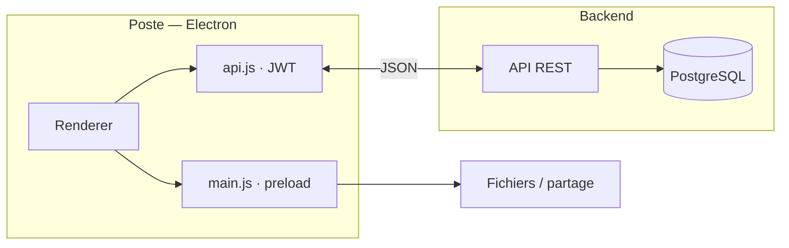

<p align="center">
  <a href="https://github.com/K0uzia/workspace/tree/main/docs"></a>
  <a href="https://github.com/K0uzia/workspace/blob/main/LICENSE"></a>
  <a href="https://github.com/K0uzia"></a>
</p>
<p align="center">
  <a href="https://github.com/K0uzia/workspace/blob/main/package.json"></a>
  <a href="https://github.com/K0uzia/workspace/blob/main/package.json"></a>
  <a href="https://github.com/K0uzia/workspace/blob/main/apps/client/package.json"></a>
</p>

**Tracebaie** est une application de bureau de **traçabilité de matériel informatique** : réception de lots, disques, commandes, dons et prêts, inventaire et archives PDF. Un agenda partagé complète l’atelier.

| Module | Rôle |
| ------ | ---- |
| **Agenda** | Calendrier partagé (semaine, mois, année) |
| **Réception** | Lots, disques, commandes, dons, prêts, inventaire et archives PDF |

Démo navigateur (données fictives, sans Electron) : [k0uzia.github.io/workspace](https://k0uzia.github.io/workspace/)

---

## Licence

Le code est **consultable** sous [Tracebaie Source-Available License](LICENSE).

| Autorisé | Soumis à autorisation écrite |
| -------- | ---------------------------- |
| Usage, étude, modification | Vente du logiciel ou d’un produit essentiellement similaire |
| Déploiement interne, y compris professionnel | Redistribution commerciale, OEM, marque blanche, offre SaaS payante |

Les dépendances tierces conservent leurs licences. Pour une licence commerciale : [github.com/K0uzia](https://github.com/K0uzia).

---

## Architecture

| Composant | Stack | Emplacement |
| --------- | ----- | ----------- |
| Client | Electron 39, HTML / JavaScript, `electron-builder` | `apps/client/` |
| Backend | Fastify, TypeScript, PostgreSQL, JWT | `proxmox/app/` |
| Démo | HTML / CSS / JS, `localStorage` | `demo/` |

Le client communique en HTTP JSON. Les URL sont définies dans `connection.json` (`local`, `proxmox`, `production`). Le processus principal (`main.js`) gère les PDF, `lsblk` (Linux) et les mises à jour.



```
workspace/
├── apps/client/          Client Electron (seul workspace npm)
├── proxmox/app/          API Fastify
├── demo/                 Démo GitHub Pages
├── docs/                 Documentation technique
└── .github/              CI, modèles d’issues et de PR
```

---

## Fonctionnement

Point d’entrée : **Agenda**. Navigation : Agenda, Reception, thème, paramètres (mises à jour).

### Agenda

Vues semaine, mois et année. Création, modification et suppression d’événements, synchronisées avec l’API. Jours fériés (métropole) en lecture seule.

### Réception

**Saisie**

| Page | Fonction |
| ---- | -------- |
| Lots | Scan ou saisie des numéros de série, type, marque, modèle. L’enregistrement crée un lot actif. |
| Disques | Session d’effacement ou de destruction. Saisie ou détection `lsblk` (Linux). PDF à l’enregistrement. |
| Commande | Lignes produits, quantités, prix. PDF et persistance. |
| Dons | Certificat de don. PDF. |
| Prêts | Fiche de prêt ou de location. PDF. |

**Suivi**

| Page | Fonction |
| ---- | -------- |
| Inventaire | Lots en cours. États, techniciens, OS. Clôture automatique et PDF final lorsque chaque machine est complète. |
| Historique | Archives (lots, disques, commandes, dons, prêts), édition selon le type, PDF, e-mail (lots et disques), marquage « récupéré ». |

```
Lots  →  Inventaire  →  Historique
Disques · Commande · Dons · Prêts  →  Historique
```

Les lots sont le seul flux avec étape Inventaire. L’authentification est un JWT silencieux (`localStorage`) : pas d’écran de compte, les API restent protégées.

**Hors produit :** Accueil, Dossier, Applications, Raccourcis, Chat, connexion, Options, Traçabilité comme page distincte.

---

## Sécurité (client)

- Content Security Policy
- Isolation Electron (`nodeIntegration: false`, `contextIsolation: true`, `preload.js`)
- JWT sur les requêtes API ; gestion HTTP 401
- Aucun secret dans le dépôt ; publication CI via `GITHUB_TOKEN`

Voir [SECURITY.md](SECURITY.md).

---

## Démarrage

Prérequis : Node.js ≥ 18.

```bash
npm ci
npm start
```

```bash
cd proxmox/app && npm install && npm run dev
```

Configurer `apps/client/public/config/connection.json`.

```bash
python3 -m http.server 8080 --directory demo
```

### Distribution

| Cible | Détail |
| ----- | ------ |
| Linux | AppImage ou `.deb` (`electron-builder`, `apps/client/dist/`) |
| Windows | NSIS ou portable |
| macOS | DMG |
| Mises à jour | `electron-updater`, GitHub Releases |
| CI | [`.github/workflows/build-client.yml`](.github/workflows/build-client.yml) |

Déploiement backend : [`proxmox/app/README.md`](proxmox/app/README.md).

---

## Documentation

- [Fonctionnement détaillé](FONCTIONNEMENT-APPLICATION.md)
- [API](docs/API.md)
- [Base de données](docs/DATABASE.md)
- [Démo](demo/README.md)

## Contribution

[Contribuer](CONTRIBUTING.md) · [Code de conduite](CODE_OF_CONDUCT.md) · [Sécurité](SECURITY.md)
